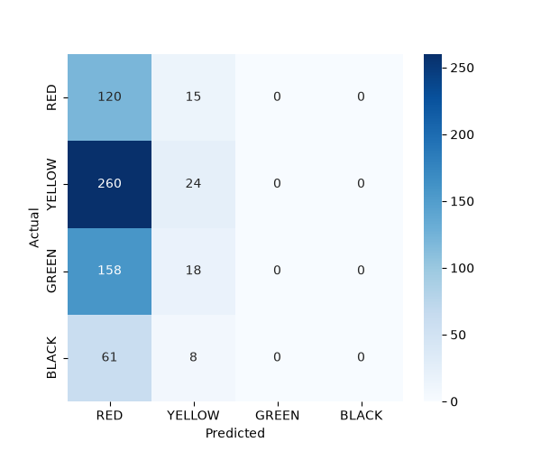

# MM26ML03: Healthcare Triage Classification

## 1. Problem and Cost Matrix
The goal is to classify emergency patients into four START triage categories: RED, YELLOW, GREEN, and BLACK. Errors have unequal costs, heavily penalizing undertriage (e.g., predicting GREEN for a RED patient). We use the official cost matrix exactly:

| Actual \ Predicted | RED | YELLOW | GREEN | BLACK |
|---|---|---|---|---|
| **RED** | 0 | 5 | 10 | 5 |
| **YELLOW** | 2 | 0 | 3 | 2 |
| **GREEN** | 1 | 1 | 0 | 1 |
| **BLACK** | 2 | 2 | 2 | 0 |

## 2. Data and Features
- Excluded `subject_id` and `race` (design choice: not a clinical signal).
- Added boolean flags indicating missing values for vital signs (`_is_missing`).
- Added START-style boolean flags (e.g., `resprate > 30`, `resprate == 0`, `heartrate == 0`, `sbp < 90`, `gcs_motor < 6`).
- Preserved zeros and NaNs in numeric vitals, as they are meaningful for specific conditions (like BLACK).

## 3. Validation
We used Repeated StratifiedGroupKFold cross-validation (grouped by `subject_id`). This ensures that multiple rows corresponding to the same patient do not leak across the train/validation splits, providing a more honest evaluation.

## 4. Models
We built a simple ensemble by averaging the probability predictions of three regularized models:
- LightGBM
- ExtraTrees Classifier
- Logistic Regression

## 5. Calibration
To ensure the output probabilities are trustworthy before applying the cost matrix, we trained a Multinomial Logistic Regression calibrator on the Out-Of-Fold probabilities.
- **Log-loss before calibration:** 0.260
- **Log-loss after calibration:** 0.214

## 6. Decision Rule
Instead of picking the class with the highest probability (argmax), we apply the minimum expected risk decision rule using the official cost matrix:
`expected_cost(j) = sum_i P(i) * Cost[i][j]`
We predict the class `j` that minimizes this expected cost.

## 7. Results & Metrics
The following metrics represent cross-validated out-of-fold estimates on the training dataset. 

### Overall Performance
By applying our minimum-risk decision rule, we strictly optimize for the lowest misclassification penalty instead of pure accuracy. 
- **Overall Accuracy:** 90.06%
- **Macro-F1:** 91.33%
- **Total Expected Misclassification Cost:** 125

### Decision Rule Comparison
This table compares standard `argmax` decisions vs our `min-risk` decision rule. Notice how our final calibrated rule entirely avoids classifying a `RED` patient as `GREEN` (Cost 10 penalty), drastically lowering the total cost penalty:

| Approach | Accuracy | Macro-F1 | Total Cost | RED predicted as GREEN |
|---|---|---|---|---|
| LightGBM argmax | 0.916 | 0.928 | 172.0 | 0 |
| Ensemble argmax | 0.926 | 0.936 | 163.0 | 1 |
| Ensemble + min-risk (uncalibrated) | 0.884 | 0.900 | 135.0 | 0 |
| **Ensemble + min-risk (calibrated, FINAL)** | **0.901** | **0.913** | **125.0** | **0** |

### Per-Class Metrics (Final Calibrated Minimum-Risk)
| Class | Precision | Recall | F1-Score | Support |
|---|---|---|---|---|
| **RED** | 0.897 | 0.963 | 0.929 | 135 |
| **YELLOW** | 0.872 | 0.915 | 0.893 | 284 |
| **GREEN** | 0.922 | 0.807 | 0.861 | 176 |
| **BLACK** | 0.985 | 0.957 | 0.971 | 69 |

### Confusion Matrix
The confusion matrix visually demonstrates how our model safely biases towards over-triaging (predicting more severe classes) rather than under-triaging, minimizing the asymmetric cost.

## 8. Note on Predicted Labels
**Important:** Because of the minimum-risk decision rule, the predicted label will frequently differ from the class with the highest probability. The model prioritizes safety (lower expected cost) over raw accuracy.

## 9. Run the Web Demo
To run the interactive web demonstration locally:
1. Start the backend: `uvicorn backend.main:app --reload --port 8000`
2. Start the frontend (in the `frontend/` directory): `npm run dev`
